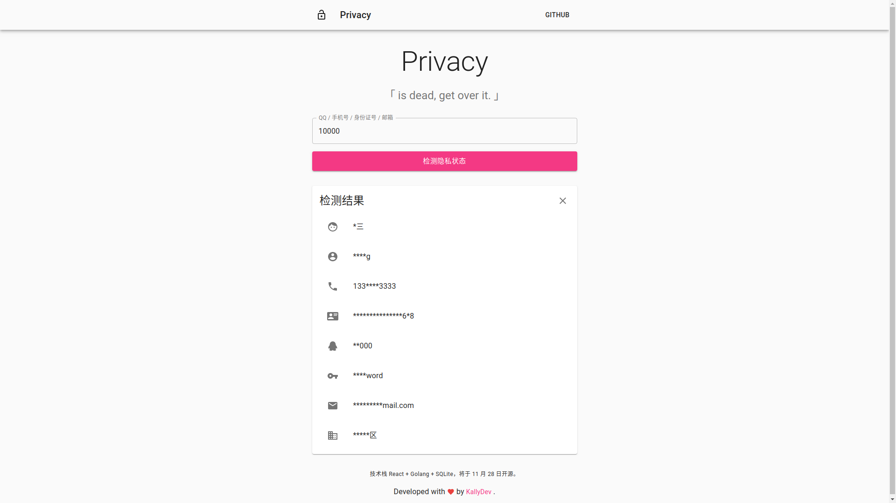

# Privacy


个人数据泄漏检测网站，适用于近期流传的 40GB+ 数据。

> 所有数据均来源于互联网，仅用于查询个人信息泄露情况，请勿用于非法目的。

## 示例截图



可以前往预览 [示例网站](https://privacy.kallydev.com/)（暂未部署最新版本）。

## 使用方法

### 导入数据

数据来源于近期流传的 40GB+ 的压缩包，目前已支持 QQ / JD / SF 的多表查询。

1. 创建 SQLite 数据库

在项目文件夹根目录下创建并进入 database 文件夹，创建数据库。

```bash
mkdir database && cd database
sqlite3 database.db
```

分别执行以下 SQL 语句，用于创建 QQ / JD / SF 数据表。

```sql
CREATE TABLE qq
(
    id           BIGINT,
    qq_number    BIGINT,
    phone_number INT
);
```

```sql
CREATE TABLE jd
(
    id           BIGINT,
    name         TEXT,
    nickname     TEXT,
    password     TEXT,
    email        TEXT,
    id_number    TEXT,
    phone_number INT
);
```

```sql
CREATE TABLE sf
(
    id           BIGINT,
    name         TEXT,
    phone_number INT,
    address      TEXT
);
```

2. 导入 QQ 库

把 `6.9更新总库.txt` 文件放到项目根目录下的`source`目录，然后执行 `python scripts/qq.py`。

3. 导入 JD 库

把 `www_jd_com_12g.txt` 文件放到项目根目录下的`source`目录，然后执行 `python scripts/jd.py`。

- 创建索引

```bash
sqlite3 database.db
```

```sql
CREATE INDEX index_qq_qq_number ON qq (qq_number);
CREATE INDEX index_qq_phone_number ON qq (phone_number);
CREATE INDEX index_jd_email ON jd (email);
CREATE INDEX index_jd_id_number ON jd (id_number);
CREATE INDEX index_jd_phone_number ON jd (phone_number);
```

4. 导入 SF 和 WB 库

还没来得及写，欢迎 PR 或者等我明天再写。

### 编译代码

1. 安装 Yarn

```bash
npm install -g yarn
```

2. 安装 Golang

```bash
sudo apt install -y snapd
sudo snap install go --classic
```

3. 下载源代码

```bash
git clone http://github.com/kallydev/privacy
```

4. 编译前端

```bash
cd website
yarn install
yarn build
```

5. 编译后端

```bash
cd server
go build -o app main/main.go
```

### 运行

修改 `config.yaml` 配置文件，然后直接运行后端。

```bash
./app --config config.yaml
```

## TODO

- [ ] 编译 Docker 镜像
- [ ] 取模分表
- [ ] WB 账号和手机号关联查询
- [ ] 重构所有导入脚本以及编写 WB 和 SF 的导入脚本
- [ ] 自动加载支持的数据表
- [ ] 示例网站支持以上新的功能

## Q&A

### 1. 为什么代码和文档都写的这么生草？

我当时只是随口说了一个时间，结果才发现安排得有亿点紧，于是就开始放飞自我。之后会逐步进行重构，**同时也欢迎发起 PR**。

### 2. 部署或使用遇到问题如何解决?

1. 在这个 Repo 发起 Issues，空余时间我会协助你解决。
2. 把错误信息粘贴到 `https://stackoverflow.com/search?q=` 这个链接后面，然后浏览器打开。
3. 因为个人并不喜欢回复 PM，所以 Telegram 之类问我问题不太可能会回复。
4. 通往罗马的道路千万条，自己努力吧少年。

### 3. 为什么示例网站只支持 QQ 和手机号关系查询?

示例服务器的硬盘不够，而且这些大文件传输特别麻烦，先搁置一段时间。

### 4. 为什么导入脚本会提示出现无效数据?

因为源数据的格式实在是太乱了，存在大量错排。脚本会自动忽略这些解析失败的数据。

### 5. 为什么不提供数据库文件?

众所周知传播这些数据属于违法行为，所以这个项目不提供相关数据。

## License

Copyright (c) KallyDev. All rights reserved.

Licensed under the [MIT](LICENSE).
